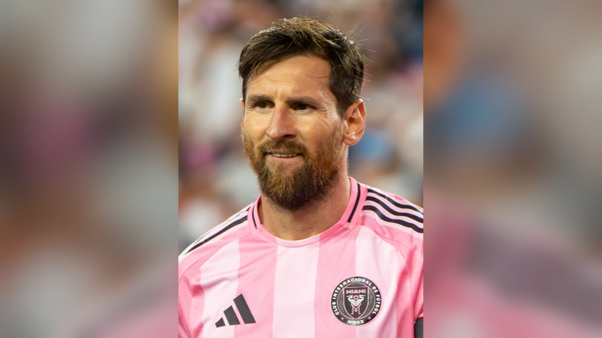

# Месси – лучший бомбардир в истории чемпионатов мира: 18 голов

*Лионель Месси довёл число голов на чемпионатах мира до 18 и обошёл Клозе и Мбаппе, став лучшим снайпером в истории мировых первенств.*

- **type:** transfer
- **category:** Тренды
- **slug:** messi-rekord-bombardir-chm-18-golov

Лионель Месси переписал историю чемпионатов мира. Капитан сборной Аргентины стал лучшим бомбардиром в истории мировых первенств, доведя свой счёт голов до **18** и обойдя прежних рекордсменов – Мирослава Клозе и Килиана Мбаппе, у которых по 16 мячей.

## Как Месси установил рекорд

На старте турнира в США, Канаде и Мексике Месси феерил. В матче открытия против Алжира аргентинец оформил хет-трик, а затем добавил дубль в поединке с Австрией, который завершился победой действующих чемпионов мира со счётом 2:0. Этими мячами форвард довёл свой бомбардирский счёт на чемпионатах мира до исторических 18 голов всего за два матча текущего турнира.

Прежний рекорд составлял 16 мячей и принадлежал немцу Мирославу Клозе, к которому на этом мировом первенстве вплотную приблизился француз Килиан Мбаппе. Теперь же Месси единолично возглавил список лучших снайперов в истории чемпионатов мира – и при этом продолжает оставаться действующим лидером гонки бомбардиров турнира 2026 года.

## Список лучших бомбардиров в истории ЧМ

| Игрок | Голы на ЧМ |
| --- | --- |
| Лионель Месси (Аргентина) | 18 |
| Мирослав Клозе (Германия) | 16 |
| Килиан Мбаппе (Франция) | 16 |
| Роналдо (Бразилия) | 15 |
| Герд Мюллер (Германия) | 14 |

*Данные приведены по информации Fox Sports и Yahoo Sports.*

## Почему это важно

Месси и без того считается одним из величайших футболистов в истории, а победа на чемпионате мира 2022 года в Катаре закрыла главный пробел в его карьере. Новый рекорд по голам на мировых первенствах – ещё один штрих к его наследию. Для болельщиков из Казахстана и стран СНГ, где Месси невероятно популярен, его достижение стало одной из самых обсуждаемых тем чемпионата.

## Что дальше

Аргентина уверенно стартовала и уже решает турнирные задачи в своей группе, а её капитан, играющий, возможно, на своём последнем мировом первенстве, продолжает переписывать историю футбола. Впереди – стадия плей-офф, где ставки будут только расти. Сколько ещё голов добавит в свой актив Месси и сумеет ли Аргентина защитить чемпионский титул – вопросы, за которыми будет следить весь футбольный мир.

Источники: Fox Sports, Yahoo Sports.
