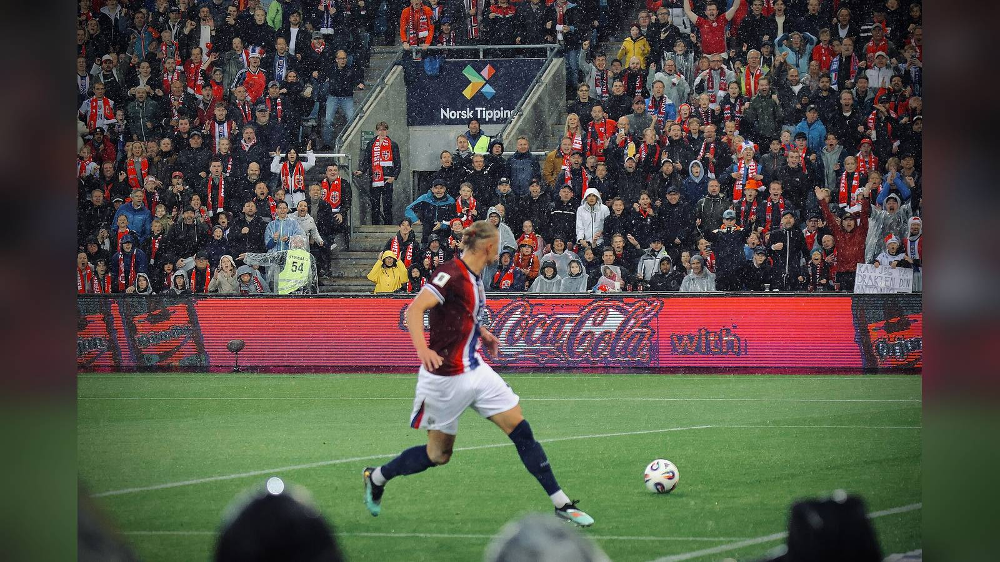

*Эрлинг Холанд оформил дубль в концовке, и Норвегия впервые в истории вышла в четвертьфинал чемпионата мира, сенсационно обыграв Бразилию 2:1 в 1/8 финала ЧМ-2026.*

**Норвегия сенсационно обыграла Бразилию 2:1 в матче 1/8 финала чемпионата мира 2026 и впервые в своей истории вышла в четвертьфинал.** Дубль в концовке оформил Эрлинг Холанд, отправив пятикратных чемпионов мира домой на «Нью-Йорк Нью-Джерси Стэдиум» в Ист-Ратерфорде. Для скандинавов это первый чемпионат мира за 28 лет – и сразу выход в восьмёрку сильнейших.

## Как развивался матч

Ключевым эпизодом первого тайма стал незабитый пенальти: на 34-й минуте вратарь норвежцев Эрьян Нюланд парировал удар с точки от Бруну Гимарайнша, сохранив ворота в неприкосновенности. Этот сейв во многом задал тон всей встрече и придал скандинавам уверенности.

Долгое время Бразилия владела инициативой, но всё решил отрезок в концовке, когда на первый план вышел Холанд. На 79-й минуте норвежец выиграл верховую борьбу у Габриэла и головой пробил Алиссона после навеса Андреаса Шелдерупа – 1:0. На 90-й минуте капитан скандинавов удвоил счёт: он принял передачу того же Шелдерупа и мощным ударом с линии штрафной поразил нижний угол. Неймар реализовал пенальти на 90+10-й минуте, но это стало лишь голом престижа – отыграться у «селесао» уже не было времени.

## Таблица матча

| Показатель | Значение |
| --- | --- |
| Турнир | ЧМ-2026, 1/8 финала |
| Счёт | Норвегия 2:1 Бразилия |
| Голы Норвегии | Холанд (79), Холанд (90) |
| Гол Бразилии | Неймар (90+10, пен.) |
| Сейв | Нюланд отразил пенальти Гимарайнша (34) |
| Место | Ист-Ратерфорд, США |

## Историческое значение

Двумя мячами в последние 11 минут Холанд довёл свой счёт на турнире до семи голов и сравнялся с Лионелем Месси и Килианом Мбаппе в гонке за «Золотую бутсу». Но куда важнее командный результат: Норвегия впервые в своей истории вышла в четвертьфинал чемпионата мира, причём сделала это на своём первом мировом первенстве за 28 лет. Скандинавы доказали, что их поколение во главе с Холандом способно решать задачи высшего уровня.

Для Бразилии же поражение обернулось катастрофой: самый ранний вылет «селесао» с чемпионата мира с 1990 года и очередной удар по амбициям пятикратных чемпионов. Разбор причин неудачи и будущее сборной наверняка станут одной из главных тем ближайших недель в бразильском футболе.

## Что дальше

В четвертьфинале 11 июля в Майами Норвегия сыграет с Англией, которая прошла Мексику в другом матче 1/8 финала. Скандинавов ждёт проверка на прочность против одного из фаворитов турнира, но после победы над Бразилией команда Холанда выйдет на игру предельно уверенной.

> «Холанд забил дважды, и Норвегия ошеломила Бразилию 2:1», – пишет Al Jazeera.

Источники: Al Jazeera, Sky Sports, NBC Sports.
