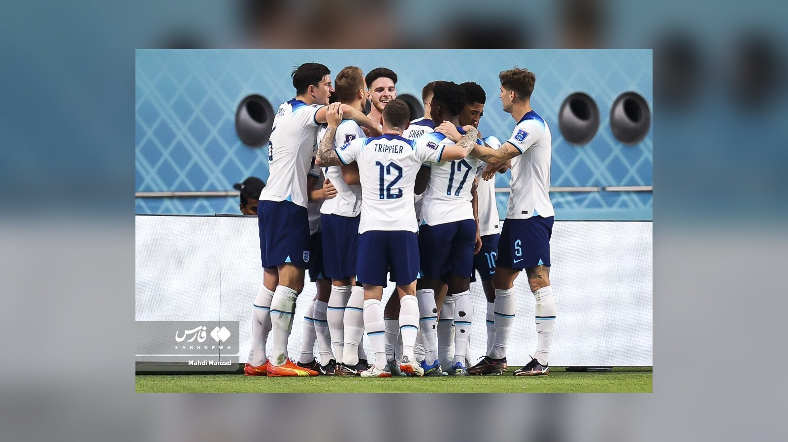

*Сенсационная Норвегия Эрлинга Холанда встретится с Англией в четвертьфинале ЧМ-2026 11 июля в Майами. Разбираем дуэль лучших бомбардиров и расклад на матч.*

**Норвегия и Англия сыграют в четвертьфинале чемпионата мира 2026 в субботу, 11 июля, на стадионе в Майами.** Матч сводит вместе две команды, добравшиеся до восьмёрки сильнейших разными путями, и обещает дуэль топ-бомбардиров – Эрлинга Холанда против Гарри Кейна и Джуда Беллингема. Начало встречи – в 17:00 по времени восточного побережья США.

## Как команды вышли в четвертьфинал

Норвегия устроила главную сенсацию турнира, обыграв Бразилию 2:1 в 1/8 финала благодаря дублю Холанда, и впервые в истории пробилась в четвертьфинал. Англия прошла Мексику 3:2 в драматичном матче на «Ацтеке», где Беллингем оформил дубль, а команда удержала победу в меньшинстве.

## Ключевая дуэль: Холанд против Кейна

По данным World Soccer Talk и FOX Sports, Холанд подходит к матчу с семью голами на турнире и делит первое место в гонке за «Золотую бутсу». Гарри Кейн, рекордсмен сборной Англии по голам, забил шесть мячей и отстаёт всего на один. Джуд Беллингем добавляет пять результативных действий и своими подключениями в штрафную остаётся крайне неудобным для обороны.

| Игрок | Сборная | Голы на ЧМ-2026 |
| --- | --- | --- |
| Эрлинг Холанд | Норвегия | 7 |
| Гарри Кейн | Англия | 6 |
| Джуд Беллингем | Англия | 5 (голевых действий) |

## Что на кону

Для Норвегии это уже исторический результат: команда впервые дошла до четвертьфинала чемпионата мира. Теперь у скандинавов есть шанс замахнуться на большее, и после победы над Бразилией психологическое преимущество может оказаться на их стороне. Англия же, дошедшая до стадии восьми сильнейших, рассматривает турнир как возможность прервать многолетнее ожидание крупного трофея и не имеет права недооценивать соперника.

Ключевым фактором станет то, сумеет ли английская оборона сдержать Холанда, который на ходу и забивает в важнейших матчах. С другой стороны, атака «трёх львов» во главе с Кейном и Беллингемом способна создать проблемы любой защите.

## Прогноз

Англия считается небольшим фаворитом за счёт опыта и глубины состава, отмечает олимпийский портал Olympics.com. Однако Норвегия уже выбила Бразилию и выйдет на игру предельно уверенной, а дуэль Холанда с английской обороной способна стать определяющей для исхода матча. Победитель пары выйдет в полуфинал ЧМ-2026.

Источники: World Soccer Talk, Olympics.com, FOX Sports.
