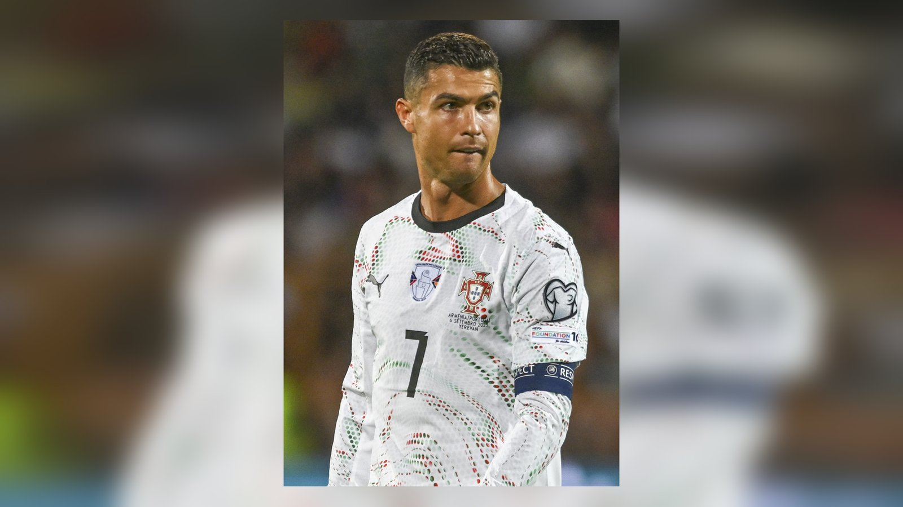

# Португалия – Испания: иберийское дерби в 1/8 финала ЧМ-2026, Роналду против Ямаля

_6 июля Португалия 41-летнего Криштиану Роналду сыграет против молодой Испании Ламина Ямаля в 1/8 финала ЧМ-2026. Превью иберийского дерби, форма и история встреч._

**Тип:** preview · **Категория:** ЧМ-2026 · **source_type:** trend

Афиша 1/8 финала чемпионата мира 2026 подарила один из самых статусных матчей турнира – иберийское дерби. 6 июля на «AT&T Стэдиум» в Арлингтоне Португалия Криштиану Роналду сыграет против Испании Ламина Ямаля. Этот поединок с огромным интересом ждут во всём футбольном мире, включая регион КЗ и СНГ, где обе сборные традиционно имеют массу поклонников.

Соседи по Пиренейскому полуострову встречаются на стадии плей-офф мирового первенства – ставки максимальны, а на кону место в четвертьфинале. Добавляет остроты и то, что этот матч сводит вместе два поколения: уходящую эпоху в лице Роналду и новую волну испанского футбола.

## Путь к очной встрече

Португалия в 1/16 финала прошла Хорватию в упорной борьбе – 2:1: Криштиану Роналду реализовал пенальти, а победный мяч головой на 94-й минуте забил Гонсалу Рамуш. Матч получился нервным, и португальцам понадобился характер, чтобы дожать соперника на последних минутах. Испания же уверенно разобралась с Австрией 3:0, причём поздний гол Микеля Оярсабаля довёл его личный счёт на турнире до четырёх мячей. «Красная фурия» подошла к дерби, не пропустив ни одного мяча на всём чемпионате – показатель, говорящий о выдающейся организации игры в обороне.

| Сборная | Матч 1/16 финала | Счёт |
| --- | --- | --- |
| Португалия | против Хорватии | 2:1 |
| Испания | против Австрии | 3:0 |

## Опыт против молодости

Это не просто матч 1/8 финала – это столкновение поколений. С одной стороны – 41-летний Криштиану Роналду, который довёл число своих голов на крупных международных турнирах до 25, что на пять больше, чем у любого другого европейца. Легендарный форвард по-прежнему остаётся лидером сборной и способен решить исход одним эпизодом. С другой стороны – яркое молодое поколение Испании во главе с Ламином Ямалем и мощная средняя линия «красной фурии», где каждый исполнитель умеет контролировать мяч и темп.

## История противостояний

Испания и Португалия провели между собой 41 матч на международном уровне. Перевес – за испанцами: 17 побед против 6 у португальцев при 17 ничьих, приводит статистику Goal. Однако история подобных дерби показывает, что статистика редко влияет на исход конкретного кубкового матча, где всё решают детали и настрой.

| Показатель | Значение |
| --- | --- |
| Всего матчей | 41 |
| Победы Испании | 17 |
| Победы Португалии | 6 |
| Ничьи | 17 |

## Что может решить исход

Ключевым станет противостояние испанского контроля мяча и умения португальцев играть вторым номером с быстрыми выпадами. Если «красная фурия» сохранит свою фирменную непроходимость в обороне, ей будет достаточно одного точного удара, чтобы решить исход. Португалии же понадобится терпение и реализация редких моментов – а в этом компоненте у команды есть Роналду и Гонсалу Рамуш, уже отличившийся победным голом в 1/16 финала.

Отдельная интрига – дуэль ветерана Роналду с юным Ямалем, которую подают как символическую передачу эстафеты в европейском футболе. Оба способны в одиночку изменить ход матча, и именно их действия в решающие моменты могут стать определяющими.

## Прогноз

Испания подходит к дерби в статусе фаворита: надёжная оборона без пропущенных мячей и глубина состава дают ей преимущество. Но опыт Роналду и умение португальцев играть на результат в кубковых матчах способны перевернуть любой расклад. Многое будет зависеть от того, сумеет ли Испания навязать свой контроль мяча, а Португалия – использовать редкие шансы у чужих ворот. Победитель иберийского дерби сделает серьёзную заявку на выход в полуфинал турнира.

Источники: World Soccer Talk, NBC, Goal.
