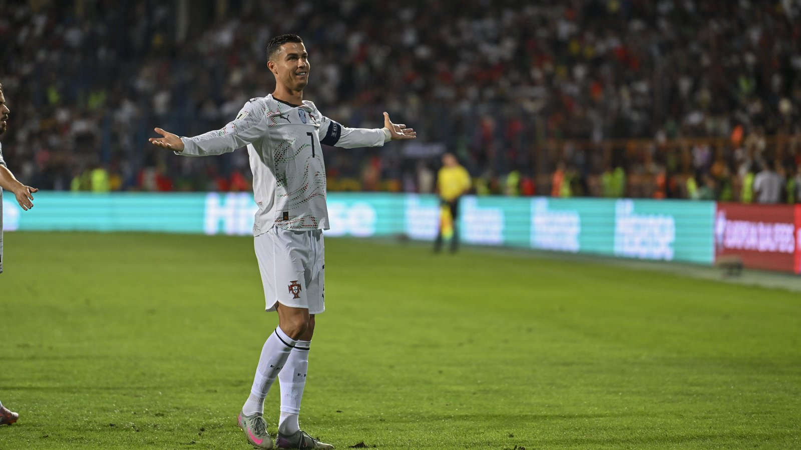

# Португалия – Хорватия: Роналду против Модрича в матче 1/16 финала ЧМ-2026

_Чемпионат мира 2026 свёл в 1/16 финала Португалию и Хорватию. Матч в Торонто станет очной дуэлью двух легенд – Криштиану Роналду и Луки Модрича, для которых этот турнир почти наверняка последний._

- **type:** preview  
- **category:** ЧМ-2026  
- **slug:** portugal-vs-croatia-round-of-32-ronaldo-modric-wc2026

---

Чемпионат мира 2026 подарил болельщикам одну из самых статусных пар 1/16 финала: Португалия сыграет с Хорватией. Матч пройдёт 2 июля на стадионе «БМО Филд» в Торонто (3 июля, 02:00 по московскому времени). Это противостояние двух легенд – 41-летнего Криштиану Роналду и 40-летнего Луки Модрича, для которых турнир в США, Канаде и Мексике почти наверняка станет последним чемпионатом мира.

## Путь к плей-офф

Португалия заняла второе место в группе K с пятью очками: ничья с ДР Конго (1:1), разгром Узбекистана (5:0) и нулевая ничья с Колумбией (0:0), которая и выиграла группу.

Хорватия финишировала второй в группе L, набрав шесть очков. Подопечные Златко Далича уступили Англии (2:4), но затем обыграли Панаму (1:0) и Гану (2:1). В матче с Ганой Лука Сучич открыл счёт на 31-й минуте, во втором тайме африканцы сравняли, а победный мяч на 83-й забил Никола Влашич – после подачи Модрича.

| Форма (3 матча) | Результаты |
|-----------------|-----------|
| Португалия | 1:1 ДР Конго, 5:0 Узбекистан, 0:0 Колумбия |
| Хорватия | 2:4 Англия, 1:0 Панама, 2:1 Гана |

## Роналду и Модрич: последний танец

Криштиану Роналду подходит к плей-офф с двумя голами на турнире – дубль в ворота Узбекистана сделал его первым в истории футболистом, забивавшим на шести разных чемпионатах мира, и лучшим бомбардиром сборной Португалии в финальных стадиях ЧМ. Лука Модрич остаётся дирижёром хорватской полузащиты: на его счету результативная передача в матче с Ганой.

## История встреч

Команды не раз пересекались на больших турнирах. Самая памятная встреча – 1/8 финала Евро-2016, где Португалия победила 1:0 в дополнительное время и затем выиграла тот чемпионат Европы. Пересекались соперники и в недавних розыгрышах Лиги наций.

| Турнир | Матч | Счёт |
|--------|------|------|
| Евро-2016, 1/8 финала | Португалия – Хорватия | 1:0 (д.в.) |

## Чего ждать

Это классическое противостояние опыта и характера. Португалия располагает более глубоким и мощным составом, но Хорватия под руководством Модрича не раз доказывала, что в матчах на вылет её рано списывать со счетов. Кадровых потерь, способных серьёзно повлиять на расклад, перед игрой не сообщалось.

Источники: Sky Sports, CP24, FOX Sports, «Спорт-Экспресс».

---

**sources:**
- https://en.wikipedia.org/wiki/2026_FIFA_World_Cup_Group_K
- https://en.wikipedia.org/wiki/2026_FIFA_World_Cup_Group_L
- https://www.skysports.com/football/news/12098/13556636/world-cup-2026-bracket-and-knockout-fixtures-whos-facing-who-in-the-last-32-and-route-to-final
- https://www.cp24.com/local/toronto/2026/06/28/ronaldo-portugal-to-face-croatia-at-toronto-stadium-in-world-cup-round-of-32/
