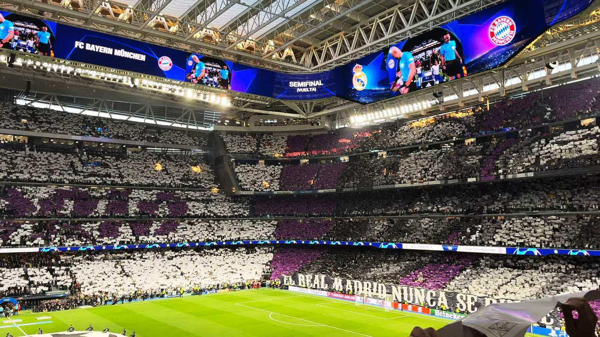

# Предсезонное Эль-Класико: «Реал» и «Барселона» сыграют в Техасе 29 июля

_«Реал» и «Барселона» проведут предсезонное Эль-Класико 29 июля на стадионе «АТ&Т» в Арлингтоне. Разбираем контекст первого свидания грандов перед новым сезоном._

**Категория:** Тренды · **Тип:** preview

Главная афиша мирового футбола вернётся уже в конце июля: «Реал Мадрид» и «Барселона» проведут предсезонное Эль-Класико. По информации CBS Sports, матч пройдёт 29 июля 2026 года на стадионе «АТ&Т» в Арлингтоне (штат Техас) в рамках предсезонной серии из восьми матчей с участием шести клубов, среди которых также «Манчестер Юнайтед», «Арсенал», «Милан» и «Ювентус».

Несмотря на товарищеский статус, встреча двух испанских грандов традиционно привлекает огромное внимание болельщиков в Казахстане и странах СНГ, где у обоих клубов миллионы поклонников. Эль-Класико остаётся матчем, который смотрят вне зависимости от турнирного значения.

## Что стоит на кону

Предсезонное Класико – это не про очки, а про тонус, сыгранность и первые сигналы перед новым сезоном. Для тренерских штабов это возможность обкатать состав, проверить новичков и наиграть связи после летнего трансферного окна. Для болельщиков же это первый повод сравнить силу вечных соперников и оценить, кто лучше подошёл к старту кампании.

Матч в США – часть большого предсезонного турне европейских грандов по Северной Америке, где клубы совмещают подготовку с коммерческими и имиджевыми задачами на одном из ключевых для футбола растущих рынков.

## Факты о матче

| Параметр | Значение |
| --- | --- |
| Соперники | «Реал Мадрид» – «Барселона» |
| Дата | 29 июля 2026 |
| Стадион | «АТ&Т Стэдиум», Арлингтон |
| Город | Арлингтон, Техас (США) |
| Статус | Предсезонный товарищеский матч |
| Формат | Часть предсезонной серии из 8 матчей |

## История противостояния

Эль-Класико – одно из самых принципиальных дерби планеты. Мадридский «Реал» и «Барселона» десятилетиями делят между собой трофеи испанского и европейского футбола, а их очные встречи неизменно собирают миллиардные телеаудитории по всему миру. Даже в товарищеском формате обе команды выходят с максимальным настроем, ведь проигрывать принципиальному сопернику не хочет никто.

Для болельщиков в Казахстане и СНГ предсезонное Класико – ещё и удобная возможность увидеть грандов вживую в комфортное время трансляции, а также оценить, как команды перестроились после летних трансферов. Именно поэтому даже контрольные матчи этих клубов традиционно попадают в топ поисковых запросов региона.

## Составы и прогноз

Официальные заявки на предсезонный матч традиционно объявляются ближе к стартовому свистку: в товарищеских играх тренеры активно ротируют состав и дают время молодёжи, поэтому делать выводы по именам в старте преждевременно. С точки зрения зрелища такие матчи почти всегда получаются открытыми – обе команды исповедуют атакующий футбол, а Эль-Класико даже в товарищеском статусе редко обходится без голов.

Точное время начала и детали трансляции будут уточнены организаторами ближе к дате. Мы рекомендуем сверяться с официальными анонсами клубов и площадки.

> «Реал» сыграет с «Барселоной» в предсезонном Класико 29 июля в Арлингтоне, штат Техас, – сообщает CBS Sports.

Источники: CBS Sports, Forbes.
