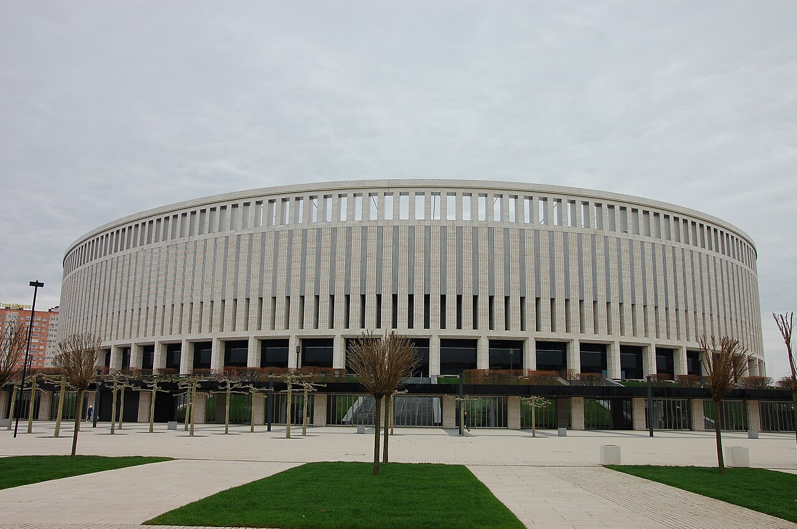

# Топ-5 сюжетов старта РПЛ-2026/27: «Краснодар» лидирует, «Зенит» уже проиграл

> Старт нового сезона РПЛ преподнёс сюрпризы: «Краснодар» единолично возглавил таблицу, а «Зенит» уже потерпел первое поражение. Собрали пять главных сюжетов начала чемпионата России.

- Категория: Тренды
- Тип: ranking
- Источник материала: trend

**Старт сезона-2026/27 в Российской премьер-лиге** уже подарил болельщикам несколько ярких сюжетов. Действующий чемпион буксует, фаворит из Санкт-Петербурга оступился, а во главе таблицы – коллектив с юга России. Собрали пять главных тем начала чемпионата. Ранжирование – по степени неожиданности и влияния на турнирную гонку. Данные приведены по состоянию на середину августа, по информации Championat и Sports.ru.

## 1. «Краснодар» – единоличный лидер

По данным Championat, после трёх туров «Краснодар» единолично возглавил РПЛ, набрав максимальные 9 очков. Действующий чемпион страны уверенно начал защиту титула и в очередной раз обыграл в гостях московский «Спартак» – уже второй раз за год. Южане демонстрируют фирменный контролирующий футбол и выглядят как одна из самых сбалансированных команд лиги на старте.

## 2. «Зенит» потерпел первое поражение

Главная сенсация тура – домашнее поражение «Зенита» от московской «Родины» со счётом 1:2. Гол Глушенкова на 23-й минуте вывел петербуржцев вперёд, однако Гарибян во втором тайме оформил дубль (59-я и 65-я минуты) и принёс новичку лиги громкую победу. Для «Зенита» это первое поражение в сезоне и тревожный сигнал: чемпионские амбиции требуют куда большей стабильности.

## 3. «Спартак» снова спотыкается дома

Московский «Спартак» уступил «Краснодару» на своём поле и потерял важные очки в борьбе за высокие места. Старт сезона в исполнении красно-белых вновь получился нестабильным, что традиционно вызывает много вопросов у болельщиков и прессы. Давление на команду и тренерский штаб растёт с каждым потерянным очком.

## 4. Плотность в верхней части таблицы

Уже после стартовых туров таблица РПЛ выглядит плотной: «Зенит» и «Спартак» идут с 6 очками, преследуя «Краснодар». Малейшая осечка лидера способна перекроить расстановку сил, а значит, борьба за чемпионство обещает быть напряжённой на протяжении всего сезона. При такой конкуренции цена каждой ошибки резко возрастает.

## 5. Сюрпризы от аутсайдеров

Победа «Родины» над «Зенитом» стала символом всего старта сезона: команды, которых заранее записывали в аутсайдеры, дают бой грандам. Такой непредсказуемый старт делает РПЛ-2026/27 особенно интересной для наблюдателей в России и странах СНГ, где чемпионат России традиционно собирает большую аудиторию.

## Итог

Первые туры показали, что борьба за титул не ограничится привычными фаворитами. «Краснодар» задал темп, «Зенит» и «Спартак» вынуждены догонять, а новички уже способны удивлять. Впереди – длинный и, судя по старту, крайне непредсказуемый сезон, за которым будут внимательно следить болельщики по всему постсоветскому пространству.

Источники: Championat, Sports.ru.

Источники (URL):
- https://www.championat.ru/football/news-6576096-zenit-poterpel-pervoe-porazhenie-v-sezone-2026-2027.html
- https://www.championat.com/football/news-6576288-chempionat-rossii-po-futbolu-2026-2027-rezultaty-na-9-avgusta-2026-kalendar-tablica.html
- https://www.sports.ru/football/tournament/rfpl/table/
