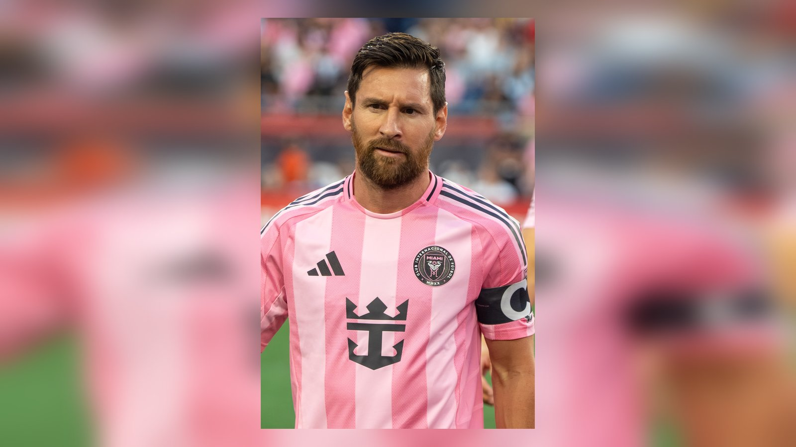

# Топ-5 фаворитов ЧМ-2026 после 1/8 финала: кто ближе всех к титулу

_Франция, Испания, Бразилия, Аргентина и Англия – пятёрка главных претендентов на титул чемпиона мира 2026 после первых матчей 1/8 финала. Разбираем форму и шансы._

**Тип:** ranking · **Категория:** Тренды · **source_type:** trend

После первых матчей 1/8 финала чемпионата мира 2026 расстановка сил на пути к титулу стала яснее. Расширенный до 48 команд мундиаль вышел на решающую стадию, где цена ошибки предельно высока, а фавориты обязаны прибавлять. Мы оценили пятёрку главных претендентов на победу в турнире, опираясь на результаты плей-офф и текущую форму команд. Этот рейтинг традиционно вызывает повышенный интерес у болельщиков в КЗ и СНГ.

## 1. Франция

«Трёхцветные» уже обеспечили себе место в четвертьфинале, обыграв Парагвай 1:0 благодаря пенальти Килиана Мбаппе. Капитан сборной идёт в лидирующей группе гонки бомбардиров с семью голами, а в первых пяти матчах турнира команда наколотила 13 мячей – один из лучших атакующих показателей чемпионата. Даже в неудобном матче против Парагвая, где игра впереди не шла, французы сумели добиться результата – признак турнирной зрелости. Глубина состава, скорость на флангах и лидерские качества Мбаппе делают Францию одним из главных фаворитов мундиаля. В четвертьфинале команду ждёт непростое Марокко, но по подбору исполнителей «трёхцветные» выглядят предпочтительнее большинства соперников.

## 2. Испания

«Красная фурия» подходит к решающим стадиям, не пропустив ни одного мяча на турнире – уникальный показатель среди всех участников. Разгром Австрии 3:0 подтвердил надёжность обороны и силу молодого поколения во главе с Ламином Ямалем. Впереди у испанцев принципиальное иберийское дерби с Португалией, которое станет серьёзной проверкой, но их баланс между дисциплиной в защите и яркой атакой впечатляет и позволяет рассчитывать на многое.

## 3. Бразилия

Пятикратные чемпионы мира под руководством Карло Анчелотти не выигрывали трофей с 2002 года и жаждут прервать затянувшуюся серию без титулов. В 1/16 финала «селесао» вырвали победу у Японии 2:1 на последних минутах благодаря голу Габриэла Мартинелли. Впереди – матч 1/8 финала против Норвегии Эрлинга Холанда, который станет проверкой амбиций бразильцев. Опыт Анчелотти и индивидуальный класс исполнителей остаются главными козырями команды.

## 4. Аргентина

Действующие чемпионы мира прошли в 1/8 финала, но их путь оказался тернистым: Кабо-Верде заставил «альбиселесте» изрядно поволноваться, и лишь в дополнительное время Аргентина вырвала победу 3:2. Лионель Месси забил свой рекордный 20-й гол на чемпионатах мира и продолжает вести команду за собой – в отчётах Sky Sports и Al Jazeera его назвали ключевой фигурой этого спасения. 7 июля аргентинцев ждёт Египет, и подопечным Лионеля Скалони важно прибавить в надёжности, чтобы подтвердить статус фаворита. Опыт победы на прошлом мундиале и лидерство Месси остаются главными аргументами чемпионов, но игра в обороне вызывает вопросы.

## 5. Англия

Сборная Томаса Тухеля движется по турниру не всегда убедительно, но результативно: в 1/16 финала «трёх львов» вновь спас капитан Гарри Кейн в матче с ДР Конго – 2:1. Теперь англичан ждёт тяжелейшее испытание на высокогорной «Ацтеке» против хозяев-мексиканцев, где против них будут работать и разреженный воздух, и трибуны. Если Англия пройдёт этот барьер в столь непростых условиях, её без сомнений будут числить среди главных претендентов на титул чемпиона мира.

## Кто ещё в игре

За пределами первой пятёрки остаются команды, способные вмешаться в спор за трофей. Португалия во главе с 41-летним Криштиану Роналду прошла Хорватию и готовится к иберийскому дерби с Испанией. Марокко, полуфиналист прошлого мундиаля, уже пробилось в четвертьфинал и на своём опыте знает, как далеко можно зайти. Не стоит списывать со счетов и Норвегию Эрлинга Холанда. Расширенный формат турнира лишь увеличил число претендентов, а первые матчи плей-офф показали, что фаворитам предстоит доказывать своё превосходство в каждой встрече.

Источники: ESPN, Sky Sports, Goal.
