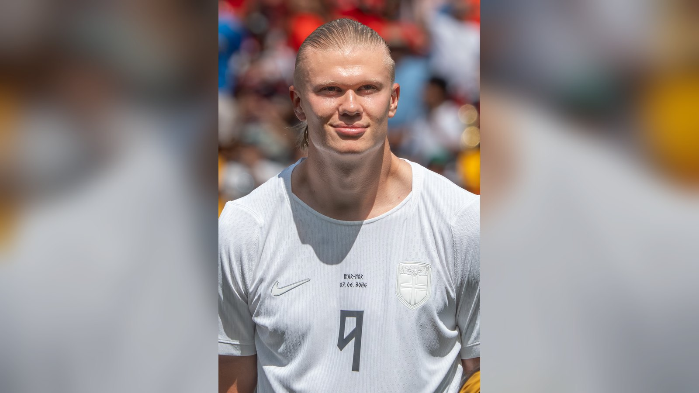

# Топ-7 бомбардиров чемпионата мира 2026 на данный момент

*Месси, Холанд, Мбаппе и другие: топ-7 лучших бомбардиров ЧМ-2026 по состоянию на 24 июня и расклад в гонке за «Золотой бутсой».*

- **type:** ranking
- **category:** Тренды
- **slug:** top-7-bombardirov-chm-2026

Чемпионат мира 2026 радует голами, а гонка бомбардиров получилась особенно жаркой. Собрали топ-7 лучших снайперов турнира на данный момент – по состоянию на 24 июня, в разгар группового этапа. Лидерство захватил Лионель Месси, но конкуренты дышат ему в спину, и впереди ещё вся стадия плей-офф, где расклад может полностью измениться. Критерий ранжирования простой – число забитых мячей на текущем мировом первенстве.

Расширение турнира до 48 команд означает больше матчей, больше голов и больше шансов для бомбардиров отличиться. Неудивительно, что многие звёзды мирового футбола уже отметились результативными действиями. Ниже – наша подборка лидеров гонки, от безоговорочного фаворита до группы преследователей, каждый из которых способен ворваться в борьбу за «Золотую бутсу».

## 1. Лионель Месси (Аргентина) – 5 голов

Капитан сборной Аргентины – безоговорочный лидер гонки. Хет-трик в матче открытия против Алжира и дубль в игре с Австрией (2:0) позволили Месси не только возглавить список бомбардиров турнира, но и стать лучшим снайпером в истории чемпионатов мира с 18 голами за карьеру. Действующие чемпионы мира уверенно решают свои задачи, а их лидер, возможно, проводит последнее мировое первенство. Если Аргентина пойдёт далеко по сетке плей-офф, у Месси будут все шансы оформить и личный трофей.

## 2. Эрлинг Холанд (Норвегия) – 4 гола

Норвежский форвард феерит на своём дебютном чемпионате мира – Норвегия впервые за 28 лет пробилась в финальную часть турнира. Его дубль в драматичном матче против Сенегала (3:2) вывел скандинавов в плей-офф и подтвердил статус Холанда как одного из лучших нападающих планеты. Мощный, быстрый и хладнокровный перед воротами, он остаётся главным козырем своей команды и одним из фаворитов в борьбе за «Золотую бутсу».

## 3. Килиан Мбаппе (Франция) – 4 гола

Лидер сборной Франции продолжает штамповать голы на мировых первенствах. На старте турнира Мбаппе уже отметился результативными действиями, в том числе дублем, и вплотную приблизился к историческим рекордам по голам на чемпионатах мира, доведя свой общий счёт до уровня лучших бомбардиров в истории. Француз сочетает скорость и реализацию, а его сборная неизменно входит в число главных претендентов на титул.

## 4. Дениз Ундав (Германия) – 3 гола

Форвард сборной Германии стал одним из главных открытий группового этапа. Три мяча Ундава – весомый вклад в атакующую игру немецкой команды, которая стремится вернуть себе статус топ-сборной после неудач последних турниров. Его форма – приятный сюрприз для тренерского штаба бундестим.

## 5. Джонатан Дэвид (Канада) – 3 гола

Канадский нападающий вдохновляет хозяев турнира. Его голы помогли сборной Канады уверенно пройти групповой этап и стать одной из приятных неожиданностей чемпионата. Опытный форвард, поигравший в Европе, прибавляет канадской атаке солидности и хладнокровия в завершении.

## 6. Криштиану Роналду (Португалия) – 2 гола

41-летний форвард сборной Португалии не собирается уходить со сцены. Дубль в ворота Узбекистана (5:0) сделал его первым игроком в истории, забивавшим на шести чемпионатах мира, а общий счёт его голов на мировых первенствах достиг десяти. Несмотря на возраст, Роналду остаётся лидером и символом своей сборной, а его голевое чутьё никуда не делось.

## 7. Харри Кейн (Англия) – 2 гола

Капитан сборной Англии традиционно входит в число самых результативных игроков крупных турниров. Кейн остаётся ключевой фигурой в атаке «трёх львов» и одним из претендентов на награду лучшего бомбардира. Если Англия наладит реализацию моментов в плей-офф, её капитан способен быстро подняться в этом списке.

## На подходе: кто ещё в гонке

Помимо лидеров, плотная группа форвардов и атакующих игроков идёт с двумя голами и готова вмешаться в борьбу при первой возможности. Среди них – бразилец Винисиус Жуниор, способный за один матч выдать дубль и взлететь вверх по таблице. В этот список также входят немец Кай Хаверц, нидерландец Коди Гакпо и испанец Микель Ойарсабаль – игроки сборных, которые традиционно претендуют на самые высокие места.

Большое число футболистов с двумя мячами говорит о том, что гонка предельно открыта. Достаточно одного яркого матча в плей-офф – и расстановка сил в споре за «Золотую бутсу» может полностью измениться. Именно поэтому следить за бомбардирской таблицей особенно интересно: лидеры могут смениться буквально за тур.

## Что важно знать о гонке

При равенстве голов в споре за «Золотую бутсу» обычно учитываются дополнительные показатели – например, голевые передачи и игровое время. Это значит, что важны не только забитые мячи, но и общий вклад игрока в атаку. На таких длинных турнирах ключевую роль играет и фактор глубины состава: тренеры берегут лидеров, ротация может стоить бомбардирам игрового времени, а значит, и голов.

## Кто получит «Золотую бутсу»?

Гонка за «Золотой бутсой» только разгорается, и впереди – стадия плей-офф, где всё может перевернуться за один матч. Пока инициативой владеет Месси, но Холанд, Мбаппе и плотная группа преследователей готовы вмешаться в спор за главный индивидуальный приз турнира. Многое будет зависеть от того, как далеко пройдут их сборные: чем больше матчей, тем больше шансов забить. Скучно в этой гонке точно не будет.

*Данные о голах приведены по информации Fox Sports и Yahoo Sports по состоянию на 24 июня 2026 года и могут измениться по итогам заключительных матчей группового этапа.*

Источники: Fox Sports, Yahoo Sports.
