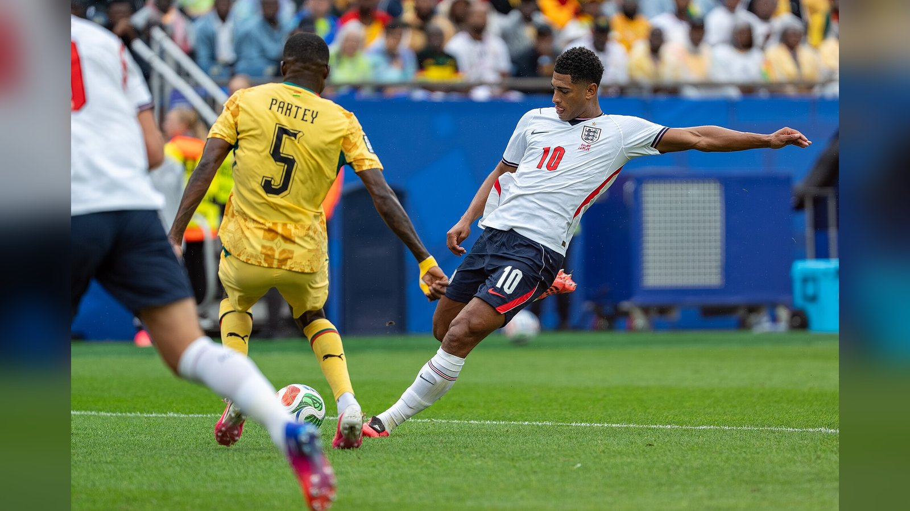

*Плей-офф чемпионата мира 2026 подарил громкие сенсации и триллеры. Собрали семь самых ярких сюжетов стадии на выбывание – от вылета Бразилии до драмы на «Ацтеке».*

**Плей-офф чемпионата мира 2026 получился богатым на сенсации:** пятикратные чемпионы отправились домой, фаворит вырвал победу в меньшинстве, а дебютанты плей-офф написали историю. Собрали семь самых громких сюжетов стадии на выбывание.

## 1. Норвегия выбивает Бразилию

Главная сенсация турнира: Норвегия обыграла Бразилию 2:1 в 1/8 финала благодаря дублю Эрлинга Холанда и впервые в истории вышла в четвертьфинал. Для «селесао» это самый ранний вылет с чемпионата мира с 1990 года, отмечает Al Jazeera.

## 2. Англия проходит Мексику в меньшинстве

На «Ацтеке» Англия одолела Мексику 3:2 в матче, который многие назвали лучшим на турнире. Джуд Беллингем оформил дубль, но после удаления Джарелла Куонсы «трём львам» пришлось более 40 минут играть вдесятером и удерживать преимущество, сообщает CNN.

## 3. Поздняя драма в иберийском дерби

Испания обыграла Португалию 1:0, а единственный мяч Микель Мерино забил лишь на 90+1-й минуте. Криштиану Роналду и партнёры завершили турнир уже в 1/8 финала.

## 4. Аргентина спаслась против Кабо-Верде

Действующие чемпионы были в двенадцати минутах от одной из крупнейших сенсаций в истории плей-офф, уступая Кабо-Верде, но автогол на 111-й минуте вывел Аргентину дальше – 3:2 в дополнительное время.

## 5. Исторический вечер Египта

Египет впервые в своей истории победил в матче плей-офф чемпионата мира, пройдя Австралию по пенальти (4:2) после ничьей 1:1. Для команды Хоссама Хассана это прорыв национального масштаба.

## 6. Германия вне 1/8 финала, Нагельсманн уходит

Сборная Германии не сумела выйти в 1/8 финала третий турнир подряд, после чего Юлиан Нагельсманн покинул пост. По информации FOX Sports, среди возможных сменщиков называют Юргена Клоппа.

## 7. Швейцария прощается с Марезом

Швейцария уверенно прошла групповой этап и 1/16 финала, а её победа над Алжиром (2:0) стала прощальной для Рияда Мареза: 35-летний вингер объявил о завершении карьеры в сборной.

## Итог

Плей-офф ЧМ-2026 уже переписал несколько строк в учебниках истории: сенсационные результаты, поздние голы и прощания с легендами сделали стадию на выбывание одной из самых драматичных за последние годы. Расширенный до 48 команд формат подарил новым сборным шанс проявить себя, и им воспользовались как дебютанты плей-офф вроде Египта, так и давние аутсайдеры вроде Норвегии. Впереди – четвертьфиналы с 9 по 12 июля, полуфиналы и финал 19 июля на «Метлайф Стэдиум» в Ист-Ратерфорде.

Источники: Al Jazeera, CNN, FOX Sports, Euronews.
