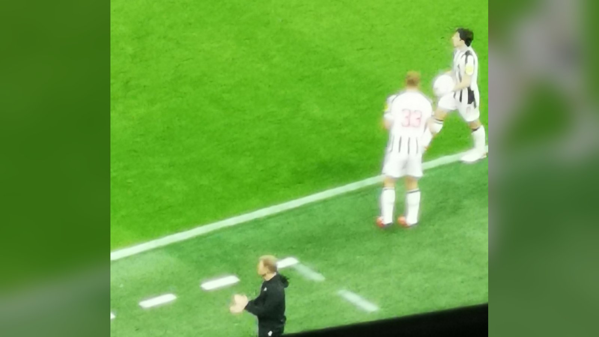

# Топ-7 матчей стартового тура АПЛ 2026/27: с чего начнётся новый сезон

> Английская Премьер-лига 2026/27 стартует 21–24 августа. Разбираем семь самых интересных матчей первого тура, за которыми стоит следить болельщикам в СНГ.

**Категория:** Тренды | **Тип:** ranking

Английская Премьер-лига возвращается: сезон 2026/27 стартует в уик-энд 21–24 августа – на неделю позже обычного из-за нагрузки на игроков после чемпионата мира 2026. Открывать чемпионат будет действующий чемпион «Арсенал». Мы выбрали семь самых интересных матчей первого тура, за которыми стоит следить болельщикам в Казахстане и СНГ.

## 1. «Арсенал» – «Ковентри Сити»
Матч открытия сезона. Чемпион Англии «Арсенал» проведёт первую встречу нового первенства дома против новичка элиты «Ковентри Сити». Для «канониров» это возможность сразу задать тон в защите титула, для «Ковентри» – исторический дебют против топ-клуба.

## 2. «Ньюкасл» – «Ливерпуль»
Один из самых статусных поединков тура. «Ньюкасл» и «Ливерпуль» – команды с большими амбициями, и очная встреча уже на старте обещает высокий темп, борьбу и полные трибуны. Отличная вывеска для первого уик-энда.

## 3. «Манчестер Сити» – «Борнмут»
«Горожане» начинают сезон домашним матчем против «Борнмута». Для команды это шанс с первых туров включиться в чемпионскую гонку, а атака «Сити» во главе с Эрлингом Холандом традиционно привлекает отдельное внимание.

## 4. «Брентфорд» – «Тоттенхэм»
Лондонское дерби в первом туре. «Тоттенхэм», активно усиливавшийся летом, откроет сезон непростым выездом к «Брентфорду» – команде, которая умеет портить настроение фаворитам. Дополнительная интрига – дебюты новичков «шпор».

## 5. «Фулхэм» – «Челси»
Ещё одно столичное противостояние. «Челси» под руководством Хаби Алонсо начнёт кампанию выездным дерби против «Фулхэма». Болельщики впервые увидят обновлённый состав «синих» в официальном матче нового сезона.

## 6. «Халл Сити» – «Манчестер Юнайтед»
«Манчестер Юнайтед» стартует с выезда к «Халл Сити». Для «красных дьяволов» первые туры всегда под особым увеличительным стеклом, и любой результат на старте будет воспринят как показатель готовности команды к сезону.

## 7. «Брайтон» – «Астон Вилла»
Матч двух команд, которые в последние годы стабильно борются за место в верхней части таблицы. «Брайтон» и «Астон Вилла» играют в смелый, атакующий футбол, поэтому встреча обещает быть открытой и результативной.

Итог: первый тур АПЛ 2026/27 подарит и матч открытия с участием чемпиона, и сразу несколько афишных вывесок. Точные даты и время начала матчей определены календарём лиги (21–24 августа), а сам сезон завершится в конце мая 2027 года.

Источники: Sky Sports, Premier League (официальный сайт).

