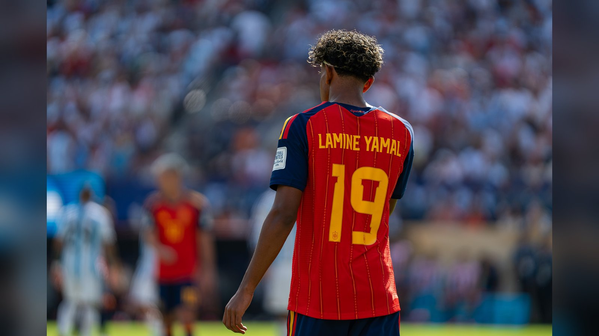

# Топ-7 претендентов на «Золотой мяч» 2026: Ямаль возглавляет список после триумфа Испании

> После победы Испании на чемпионате мира 2026 борьба за «Золотой мяч» обострилась. Разбираем семь главных претендентов на награду во главе с Ламином Ямалем.

**Категория:** Тренды | **Тип:** ranking

Чемпионат мира 2026 в США, Мексике и Канаде завершился триумфом Испании, которая в финале обыграла Аргентину со счётом 1:0 благодаря голу Ферана Торреса в дополнительное время. Такой исход серьёзно перекроил гонку за «Золотой мяч» 2026: теперь в фаворитах – игроки победившей сборной и герои клубного сезона. Окончательный список номинантов ещё не объявлен, поэтому наш рейтинг носит прогнозный характер. Ниже – семь главных претендентов на приз.

## 1. Ламин Ямаль
Главный фаворит после чемпионата мира. Вингер «Барселоны» и сборной Испании был признан лучшим игроком турнира и получил «Золотой мяч» ЧМ (Golden Ball). Ямаль стал первым в истории футболистом, который выиграл и чемпионат Европы, и чемпионат мира, будучи подростком. Для 19-летнего испанца индивидуальная награда выглядит логичным продолжением фантастического сезона.

## 2. Феран Торрес
Человек, забивший решающий гол в финале ЧМ. Точный удар Торреса на 106-й минуте принёс Испании второй титул чемпионов мира в истории. Форвард стал героем главного матча четырёхлетия, и этот вклад в чемпионство неизбежно поднимает его в гонке за индивидуальные призы.

## 3. Педри
Мозг полузащиты чемпионов мира. Педри снова был одним из ключевых игроков сборной Испании: его контроль мяча, пас и умение диктовать ритм во многом определяли игру команды на турнире. Полузащитники редко выигрывают «Золотой мяч», но роль Педри в успехе «Роха» переоценить сложно.

## 4. Родри
Обладатель «Золотого мяча» 2024 остаётся в числе претендентов и теперь уже как чемпион мира в составе Испании. Опыт, лидерство и умение Родри цементировать середину поля делают его одним из самых уважаемых игроков своего амплуа – и постоянным участником подобных списков.

## 5. Усман Дембеле
Обладатель «Золотого мяча» 2025 и лидер атак ПСЖ, с которым француз в прошлом сезоне выиграл Лигу чемпионов. Клубные достижения Дембеле остаются весомым аргументом, даже если чемпионат мира сложился для сборной Франции не по максимальному сценарию.

## 6. Лионель Месси
39-летний аргентинец снова довёл свою сборную до финала чемпионата мира, где Аргентина уступила Испании лишь в дополнительное время. Символическую «передачу эстафеты» от Месси к Ямалю после финала отметили ведущие мировые СМИ. Даже в статусе вице-чемпиона легенда остаётся в разговоре о лучших.

## 7. Витинья
Ещё один представитель ПСЖ, победителя Лиги чемпионов. Португальский полузащитник провёл сильный клубный сезон и стал одним из моторов команды, добравшейся до вершины европейского футбола. В расширенном списке номинантов его имя выглядит вполне уместно.

Итог: после чемпионского для Испании лета в гонке за «Золотой мяч» именно испанцы задают тон, а Ламин Ямаль – главный кандидат на приз. Впрочем, последнее слово останется за голосованием, и окончательный расклад мы узнаем ближе к церемонии.

Источники: beIN Sports, Olympics.com, NPR, Sportzone.

