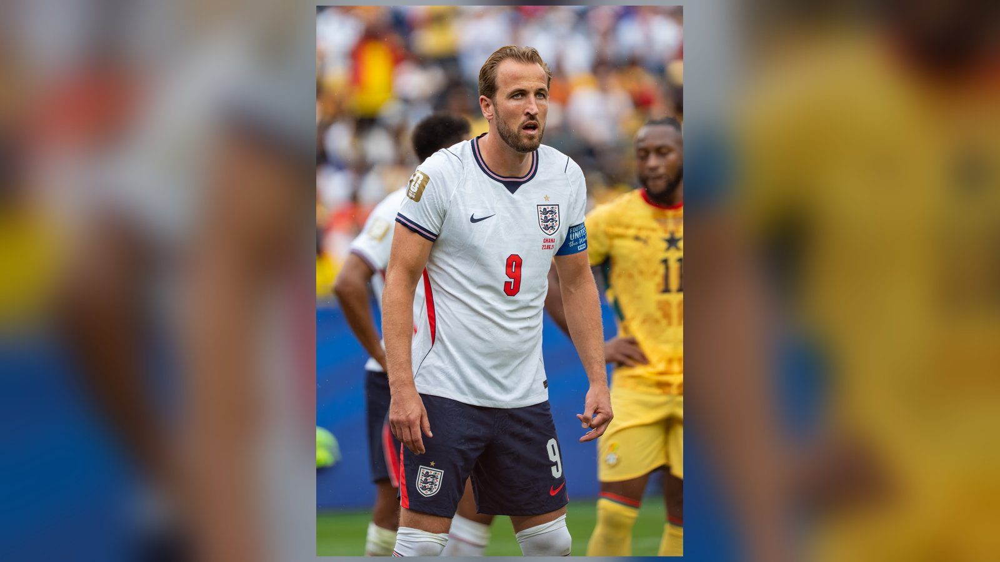

# Топ-7 бомбардиров ЧМ-2026: Месси возглавил гонку за «Золотую бутсу»

_Месси с восемью голами лидирует в гонке за «Золотую бутсу» ЧМ-2026 и переписывает рекорды. Собрали семёрку лучших бомбардиров турнира перед стартом четвертьфиналов._

**Категория:** Тренды | **Тип:** ranking | **source_type:** trend

Гонка за «Золотую бутсу» чемпионата мира 2026 года вышла на решающую стадию. К старту четвертьфиналов сразу несколько звёзд мирового футбола ведут ожесточённый спор за приз лучшего бомбардира турнира. Мы собрали семёрку лидеров по числу забитых мячей – по данным TNT Sports и Goal на момент завершения 1/8 финала. Важно помнить правило ФИФА: при равенстве голов выше в таблице располагается игрок с большим числом результативных передач, а если и этот показатель одинаков – учитывается игровое время.

Интрига обостряется тем, что почти все главные претенденты остаются в розыгрыше и продолжат пополнять свои счета в матчах на выбывание.

## 1. Лионель Месси (Аргентина) – 8 голов

Капитан «Альбиселесте» возглавляет гонку и попутно переписывает историю мировых первенств. По ходу турнира Месси стал лучшим бомбардиром в истории чемпионатов мира, доведя общее число своих голов на мундиалях до рекордных 21. Его точный удар в ворота Египта в 1/8 финала помог действующим чемпионам отыграться со счёта 0:2 и избежать сенсационного вылета. В свои 39 лет аргентинец продолжает быть решающим фактором в ключевых матчах.

## 2. Килиан Мбаппе (Франция) – 7 голов

Лидер сборной Франции идёт практически вровень с Месси и всего в шаге от того, чтобы догнать конкурента. Мбаппе – главная ударная сила самой результативной команды турнира, забившей 14 мячей за пять матчей. Француз находится в отличной форме перед четвертьфиналом против Марокко и обладает всеми шансами возглавить гонку, если Аргентина оступится раньше.

## 3. Эрлинг Холанд (Норвегия) – 7 голов

Норвежский форвард забивает в каждом из четырёх матчей на турнире – феноменальная стабильность. Его дубль в ворота Бразилии отправил пятикратных чемпионов мира домой и впервые в истории вывел Норвегию в четвертьфинал крупного турнира. Для Холанда, долго не имевшего возможности блеснуть на мундиале, этот чемпионат мира стал настоящим прорывом.

## 4. Гарри Кейн (Англия) – 6 голов

Капитан сборной Англии стабильно поражает ворота соперников и лишь в третий раз в истории довёл число голов английского футболиста на одном крупном турнире до шести. В четвертьфинале Кейна ждёт символичная прямая дуэль с Холандом: победитель этой пары не только пройдёт дальше, но и получит преимущество в борьбе за «Золотую бутсу».

## 5. Усман Дембеле (Франция) – 4 гола

Обладатель «Золотого мяча» возглавляет плотную группу игроков с четырьмя голами. Его хет-трик в ворота Норвегии на групповом этапе стал одним из самых ярких индивидуальных эпизодов первого раунда. Вместе с Мбаппе Дембеле формирует, возможно, самую опасную атакующую связку турнира.

## 6. Джуд Беллингем (Англия) – 4 гола

Полузащитник сборной Англии добавил своей команде голевой угрозы из глубины и делит место в топ-7 с целым квартетом бомбардиров, у которых также по четыре мяча. Его умение врываться в штрафную и завершать атаки делает англичан ещё более непредсказуемыми в плей-офф.

## 7. Винисиус Жуниор (Бразилия) – 4 гола

Бразилец завершил свой турнир на отметке в четыре гола после сенсационного вылета «селесао» уже в 1/8 финала. На той же отметке идут Исмаила Сарр (Сенегал) и Микель Оярсабаль (Испания) – их итоговое положение в таблице определят результативные передачи и игровое время. Эта плотная группа лучше всего иллюстрирует, насколько выросла конкуренция бомбардиров на расширенном турнире.

## Итог

Судьба «Золотой бутсы» решится в матчах на выбывание. Месси, Мбаппе и Холанд остаются в розыгрыше и продолжат прямой спор за приз, тогда как Кейн способен вмешаться в борьбу уже в четвертьфинале против Норвегии. Учитывая, что впереди ещё как минимум два раунда, окончательный расклад в гонке лучших бомбардиров может измениться не раз.

**Источники:** TNT Sports, Goal, Sky Sports.

---

**Sources:**
- https://www.tntsports.co.uk/football/world-cup/2026/golden-boot-standings-lionel-messi-erling-haaland-kylian-mbappe-harry-kane-vinicius-junior-denis-undav_sto23312346/story.shtml
- https://www.goal.com/en/lists/world-cup-2026-golden-boot-standings-fifa-award/blt29fdba0896b8fd09
- https://www.skysports.com/football/news/12098/13556951/world-cup-2026-golden-boot-race-lionel-messi-kylian-mbappe-harry-kane-and-erling-haaland-in-epic-battle
