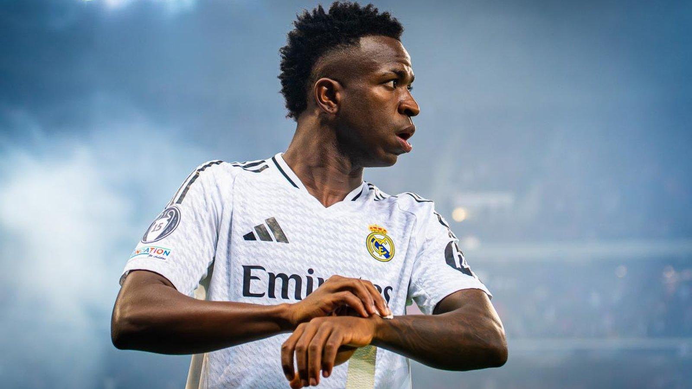

# Топ-7 звёзд группового этапа ЧМ-2026: от рекордов Месси до сенсации Кабо-Верде

_Групповой этап ЧМ-2026 позади. Вспоминаем семь главных героев первой стадии турнира – от рекордного Месси и хет-трика Дембеле до сенсационной сборной Кабо-Верде._

- **type:** ranking  
- **category:** Тренды  
- **slug:** top-7-stars-group-stage-wc2026

---

Групповой этап чемпионата мира 2026 завершился, и пора подвести его промежуточные итоги. Мы выбрали семь главных героев первой стадии турнира – по сочетанию забитых мячей, влияния на игру своих команд и резонанса. От рекордов Лионеля Месси до сенсации Кабо-Верде – вот кто гремел на групповом этапе.

## 1. Лионель Месси (Аргентина)

Капитан Аргентины возглавил список бомбардиров группового этапа с шестью голами и переписал сразу несколько рекордов. Месси довёл число своих мячей на чемпионатах мира до 19 и остаётся лучшим бомбардиром в истории турниров, а также стал первым, кто забивал в семи матчах ЧМ подряд. Хет-трик в ворота Алжира сделал его самым возрастным автором хет-трика в истории мировых первенств – 38 лет и 357 дней.

## 2. Усман Дембеле (Франция)

Действующий обладатель «Золотого мяча» провёл феерический групповой этап и завершил его хет-триком в ворота Норвегии, оформленным всего за 25 минут (7'–32') – это второй по скорости хет-трик в истории чемпионатов мира. На счету Дембеле четыре мяча, и он остаётся одним из лидеров гонки бомбардиров.

## 3. Килиан Мбаппе (Франция)

Партнёр Дембеле по сборной Франции также забил четыре мяча. По данным ESPN, Мбаппе вошёл в число немногих игроков с 20 и более результативными действиями на чемпионатах мира (голы плюс передачи), оказавшись в компании Месси и Мирослава Клозе.

## 4. Винисиус Жуниор (Бразилия)

Вингер «Реала» стал мотором атаки пентакампеонов и наколотил четыре мяча на групповом этапе. Скорость и дриблинг Винисиуса делают Бразилию одним из главных фаворитов в плей-офф.

## 5. Исмаэль Саиби (Марокко)

Полузащитник ПСВ – одно из открытий турнира. Саиби отметился голами во всех трёх матчах группового этапа и стал первым африканцем, забившим в каждой из трёх игр группы на чемпионате мира со времён Асамоа Гьяна (Гана, 2010).

## 6. Дениз Ундав (Германия)

Нападающий «Штутгарта» превратился в главного джокера сборной Германии. Выходя на замену, Ундав записал на свой счёт три гола и две результативные передачи, не раз спасая немцев в концовках матчей.

## 7. Сборная Кабо-Верде

Главная командная сенсация турнира. Кабо-Верде стала наименьшей по населению страной, когда-либо выходившей в плей-офф мужского чемпионата мира. Островитяне не проиграли ни одного матча в группе, сыграв вничью с Испанией (0:0) и Уругваем (2:2), и в 1/16 финала встретятся с Аргентиной.

## Взгляд из СНГ

Для болельщиков из Казахстана и СНГ групповой этап тоже подарил повод для гордости: Аббосбек Файзуллаев забил первый в истории гол сборной Узбекистана на чемпионатах мира – в матче против Колумбии. А рекорд Месси с шестью голами на групповом этапе напомнил о достижении Олега Саленко, забившего столько же на чемпионате мира 1994 года.

Источники: World Soccer Talk, Goal.com, ESPN, «Чемпионат», UA-Football.

---

**sources:**
- https://worldsoccertalk.com/world-cup/world-cup-2026-golden-boot-table-lionel-messi-leads-top-scorers-standings-after-group-stage/
- https://www.goal.com/en/lists/world-cup-2026-golden-boot-standings-fifa-award/blt29fdba0896b8fd09
- https://www.espn.com/soccer/story/_/id/49191043/fifa-world-cup-2026-stats-ousmane-dembele-first-cristiano-ronaldo-kylian-mbappe-join-lionel-messi-miroslav-klose-cape-verde-history
- https://www.espn.com/soccer/story/_/id/49192570/cape-verde-w2026-world-cup-knockout-stage-smallest-nation
- https://www.championat.com/football/news-6523978-lionel-messi-stal-luchshim-bombardirom-chm-po-futbolu-2026-na-gruppovom-etape.html
