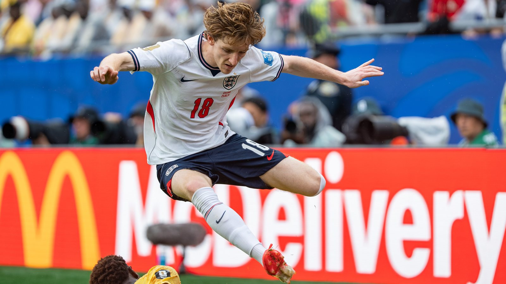

# Топ-7 трансферов лета 2026: от рекорда Эллиота Андерсона до Гордона в «Барселоне»

> **Категория:** Тренды · **Тип:** ranking · **source_type:** trend

*Летнее трансферное окно 2026 года бьёт рекорды. Собрали топ-7 самых дорогих переходов Европы – от рекордной для британцев сделки Эллиота Андерсона до перехода Энтони Гордона в «Барселону».*

---

Летнее трансферное окно 2026 года получилось по-настоящему взрывным: клубы, разгрузившиеся после чемпионата мира, устроили гонку вооружений. Мировое первенство традиционно работает как витрина: игроки, вспыхнувшие на турнире, резко дорожают, и гранды спешат ими воспользоваться. Мы собрали топ-7 самых дорогих и заметных переходов Европы этого лета (не считая отдельно разобранного рекордного трансфера Моргана Роджерса в «Челси»). Рейтинг построен по сумме сделок – по данным Sky Sports, ESPN и FootballTransfers.

## 1. Эллиот Андерсон: «Ноттингем Форест» – «Манчестер Сити» (~116 млн фунтов)

Как сообщает Sky Sports, полузащитник Эллиот Андерсон перешёл в «Манчестер Сити» за рекордные 116 млн фунтов, став на тот момент самым дорогим британским футболистом в истории (позже этот рекорд побьёт Морган Роджерс). Для 23-летнего хавбека это гигантский шаг после ярких сезонов в «Ноттингем Форест», где он превратился в одного из самых заметных британских полузащитников своего поколения. «Сити» после ухода Хосепа Гвардиолы перестраивает центр поля – и делает это с размахом, не считаясь с рекордными затратами.

## 2. Сандро Тонали: «Ньюкасл» – «Тоттенхэм» (до 100 млн фунтов)

Итальянский полузащитник Сандро Тонали сменил «Ньюкасл» на «Тоттенхэм». По информации Sky Sports, общая сумма сделки достигает 100 млн фунтов (около 92,5 млн – фиксированная часть плюс бонусы) и стала клубным рекордом лондонцев. «Шпоры» получают опытного и техничного дирижёра в центр поля.

## 3. Матеус Фернандеш: переход в «Тоттенхэм» (~85 млн фунтов)

«Тоттенхэм» продолжил тратить: португальский полузащитник Матеус Фернандеш, по данным FootballTransfers, обошёлся клубу примерно в 85 млн фунтов. Ещё одно крупное вложение амбициозных «шпор» в центр поля – лондонцы этим летом целенаправленно перекраивают среднюю линию, комбинируя опыт и молодость. Вместе с Тонали Фернандеш должен сформировать новую ось команды на несколько сезонов вперёд.

## 4. Энтони Гордон: «Ньюкасл» – «Барселона» (~80 млн евро)

Вингер сборной Англии Энтони Гордон перебрался в «Барселону». Как сообщает Sky Sports, каталонцы заплатят около 80 млн евро (базовая сумма плюс бонусы за трофеи и игровое время). Гордон подписал контракт до 2031 года и был представлен болельщикам. Для «Барсы» это статусное усиление фланга атаки игроком сборной Англии, а для самого Гордона – возможность попробовать себя в одной из сильнейших лиг мира и побороться за крупные трофеи. Английский вингер в составе каталонского гранда – ещё недавно такой сюжет казался экзотикой, а теперь стал реальностью трансферного лета-2026.

## 5. Гонсалу Рамуш: ПСЖ – «Милан» (~74 млн евро)

Португальский нападающий Гонсалу Рамуш стал самым дорогим приобретением в истории «Милана». По данным ESPN, россонери заплатили ПСЖ около 74 млн евро (с бонусами – до 90 млн). 25-летний форвард подписал контракт до 2031 года и призван вернуть «Милану» голы и стабильность в атаке. В Париже Рамуш нередко оставался в тени звёздных партнёров и выходил на замены, поэтому переход в «Милан» для него – шанс стать безоговорочным первым номером и лидером линии нападения. Для итальянского клуба же рекордная покупка – сигнал серьёзных амбиций и попытка вернуться в число грандов континента.

## 6. Исмаэль Сайбари: ПСВ – «Бавария» (~55 млн евро)

Марокканский атакующий полузащитник Исмаэль Сайбари, ярко проявивший себя на чемпионате мира, перешёл из ПСВ в мюнхенскую «Баварию». Как сообщает FOX Sports, сумма сделки составила около 55 млн евро, а контракт рассчитан до 2031 года. Мюнхенцы традиционно усиливаются героями крупных турниров, и Сайбари – классический пример такой покупки: игрок на пике интереса, подтвердивший класс на мировом первенстве. Для нидерландского ПСВ же это очередная выгодная продажа воспитанника на топ-уровень.

## 7. Марко Палестра: «Аталанта» – «Челси» (~47 млн фунтов)

Замыкает топ-7 молодой итальянский защитник Марко Палестра, перешедший из «Аталанты» в «Челси». По данным FootballTransfers, лондонцы отдали за него около 47 млн фунтов, продолжив политику скупки перспективной молодёжи со всего мира. «Челси» и здесь верен себе: клуб делает ставку на молодых игроков с высоким потолком и длинными контрактами.

## Кто ещё сменил клуб

Помимо семёрки лидеров, лето-2026 подарило и другие заметные переходы. По данным FootballTransfers, «Барселона» вдобавок к Гордону усилилась немецким вингером Каримом Адейеми из «Боруссии» Дортмунд, «Арсенал» отпустил Леандро Троссара в стамбульский «Бешикташ» примерно за 17 млн фунтов, а «Ньюкасл» пополнил оборону, забрав Аладжи Бамба из «Монако». Рынок бурлит по всей Европе, и каждый день приносит новые официальные объявления.

## Кто задал тон рынку

Если посмотреть на список в целом, бросается в глаза доминирование английской Премьер-лиги: сразу несколько сделок топ-7 связаны с клубами АПЛ – либо как покупателями, либо как продавцами. «Манчестер Сити» и «Тоттенхэм» перестраивают центр поля за девятизначные суммы, а «Ньюкасл» превратился в клуб, который продаёт своих звёзд за большие деньги.

Не отстают и континентальные гранды: «Барселона» укрепила фланг атаки Гордоном, «Милан» совершил рекордную для себя покупку Рамуша, а «Бавария» забрала одного из открытий чемпионата мира – Сайбари. Общая картина ясна: после мирового первенства ведущие клубы Европы вошли в фазу активной перестройки, не жалея средств.

## Итог

Лето-2026 подтвердило: после чемпионата мира рынок раскалён как никогда. Английские клубы задают тон по расходам, «Барселона» и «Милан» совершают статусные покупки, а «Бавария» усиливается героями мирового первенства. И это, судя по всему, ещё далеко не конец окна – впереди новые рекорды и громкие сделки, за которыми мы продолжим следить.

**Источники:** Sky Sports, ESPN, FOX Sports, FootballTransfers.

---

**Источники (sources):**
- https://www.skysports.com/football/news/11095/13558090/elliot-anderson-to-man-city-midfielder-completes-record-breaking-lb116m-transfer-from-nottingham-forest
- https://www.skysports.com/football/news/11095/13559730/sandro-tonali-tottenham-sign-italy-midfielder-in-club-record-lb100m-deal-from-newcastle
- https://www.skysports.com/football/news/11095/13548577/anthony-gordon-transfer-news-barcelona-reach-agreement-with-newcastle-for-england-international-winger
- https://www.espn.com/soccer/story/_/id/49226010/ac-milan-sign-portugal-forward-goncalo-ramos-psg
- https://www.foxsports.com/stories/soccer/bayern-munich-confirm-50m-signing-of-morocco-world-cup-hero-ismael-saibari-from-psv
- https://www.footballtransfers.com/en/transfer-news/uk-premier-league/2026/07/done-deals-every-official-completed-transfer-around-europe-today
