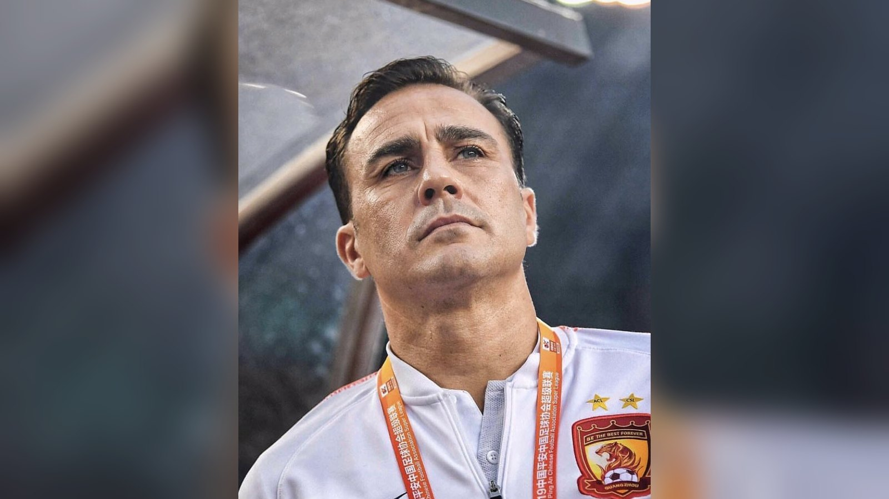

# Узбекистан – ДР Конго: дебютант ЧМ-2026 ищет первую победу

*27 июня сборная Узбекистана сыграет с ДР Конго в последнем туре группы K и попытается одержать первую в своей истории победу на чемпионате мира.*

- **type:** preview
- **category:** Сборные
- **slug:** uzbekistan-dr-congo-preview-chm-2026

Сборная Узбекистана проведёт заключительный матч группового этапа чемпионата мира 2026 против команды ДР Конго. Поединок группы K пройдёт 27 июня, и для дебютанта турнира это шанс одержать первую в своей истории победу на мировом первенстве и красиво завершить историческую кампанию.

## Тяжёлый, но исторический дебют

Чемпионат мира 2026 стал первым в истории сборной Узбекистана. Старт получился непростым: в дебютном матче подопечные Фабио Каннаваро уступили Колумбии (1:3), а затем были разгромлены Португалией (0:5), где дубль оформил Криштиану Роналду. Тем не менее сам факт выхода в финальную часть мирового первенства – огромное достижение для узбекского футбола и одно из главных спортивных событий в истории Центральной Азии.

Светлым пятном стартовых туров стал исторический гол: в матче с Колумбией полузащитник Аббосбек Файзуллаев забил первый мяч сборной Узбекистана на чемпионатах мира. Этот эпизод уже вошёл в историю национальной команды.

Отдельный символизм матчу придаёт фигура главного тренера. Командой руководит итальянец Фабио Каннаваро – чемпион мира 2006 года и обладатель «Золотого мяча», который теперь выводит на мировое первенство сборную из Центральной Азии.

| Команда | И | Очки |
| --- | --- | --- |
| Колумбия | 2 | 6 |
| Португалия | 2 | 4 |
| ДР Конго | 2 | 1 |
| Узбекистан | 2 | 0 |

*Положение команд в группе K приведено по данным ESPN перед заключительным туром.*

## Что на кону

Набрав ноль очков за два матча, сборная Узбекистана практически лишилась шансов на выход в плей-офф: для попадания в число восьми лучших команд, занявших третьи места, ей не хватает набранных очков. Однако спортивная мотивация остаётся высокой: команда будет биться за первую победу на чемпионатах мира, которая стала бы достойным завершением исторического дебюта. Соперник – ДР Конго – также испытывает серьёзные трудности и набрал лишь одно очко, поэтому очный поединок двух команд из нижней части таблицы обещает быть равным.

## Ключевые игроки

Особое внимание болельщиков из СНГ приковано к защитнику «Манчестер Сити» Абдукодиру Хусанову – одному из самых известных футболистов региона, выступающему на топ-уровне в Европе. Его переход в один из лучших клубов мира стал предметом гордости для всего узбекского футбола и примером для молодых игроков. В атаке надежды связаны с опытным форвардом Эльдором Шомуродовым, поигравшим в итальянской Серии A, и автором исторического гола Аббосбеком Файзуллаевым, который считается одним из самых талантливых молодых игроков страны.

Соперник тоже не лишён ярких индивидуальностей: в составе ДР Конго традиционно хватает быстрых и мощных атакующих футболистов, многие из которых выступают в сильных европейских чемпионатах. Это делает предстоящий матч интересным с точки зрения стиля – африканская скорость и атлетизм против организованной игры команды Каннаваро.

Узбекистану важно действовать собранно в обороне, где ключевую роль предстоит сыграть как раз Хусанову, и не позволять сопернику использовать своё главное оружие – скорость на контратаках. В то же время в атаке узбекская команда наверняка постарается сыграть смелее, чем в матчах с Колумбией и Португалией, ведь терять уже практически нечего, а первая победа на чемпионате мира стала бы исторической.

## Чего ждать от матча

Обе сборные подходят к заключительному туру в схожем психологическом состоянии: турнирные задачи фактически уже не решить, а значит, на первый план выходит профессиональная гордость и желание уйти с турнира с поднятой головой. Для Каннаваро это возможность дать игровую практику молодёжи и проверить ближайший резерв, а для лидеров – шанс завершить дебютный чемпионат мира на мажорной ноте.

Не стоит забывать и о болельщиках. Интерес к выступлению сборной Узбекистана в Казахстане и других странах СНГ огромен: для всего региона дебют узбекской команды на чемпионате мира – это общее событие и повод для гордости. Поэтому даже в матче, который ничего не решает в турнирном плане, поддержка трибун и телезрителей будет колоссальной, а сами футболисты наверняка захотят отблагодарить болельщиков ярким и боевым выступлением.

## Прогноз

Матч равных по турнирному положению команд обещает открытый футбол: обе сборные будут стремиться завершить групповой этап на позитивной ноте и без оглядки на оборону. Для Узбекистана даже первая победа на чемпионате мира станет важной вехой в развитии национального футбола и мощным стимулом для будущих поколений. Опыт, полученный на турнире такого уровня, бесценен для команды, которая лишь начинает свой путь в элите мирового футбола, и наверняка пригодится в отборочных циклах будущих чемпионатов мира. А первый дебют в финальной части турнира навсегда останется важной точкой отсчёта в истории узбекского футбола, какой бы ни оказался итог заключительного матча.

Источники: ESPN, Championat.com, Wikipedia.
