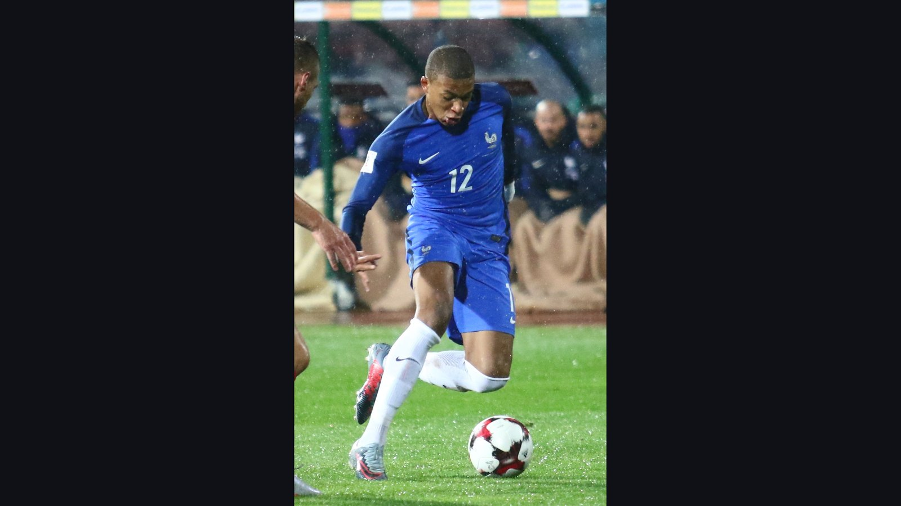

# Топ-5 претендентов на «Золотую бутсу» ЧМ-2026: Мбаппе, Кейн, Холанд и другие

> Расширенный формат ЧМ-2026 даёт бомбардирам как никогда много матчей. Разбираем пятёрку главных претендентов на «Золотую бутсу» по версии букмекеров – от Мбаппе до Винисиуса.

*Категория: Тренды · Тип: ranking · trend*

Чемпионат мира 2026 года впервые пройдёт в формате 48 команд: больше матчей группового этапа и расширенная стадия плей-офф дают форвардам как никогда много шансов наколотить голов. Кто заберёт «Золотую бутсу»? Вот пятёрка главных претендентов по версии букмекеров (FOX Sports, RotoWire).

## 1. Килиан Мбаппе (Франция)

Действующий обладатель «Золотой бутсы» и главный фаворит букмекеров с котировками около +600. На чемпионате мира 2022 года Мбаппе забил восемь голов, включая хет-трик в финале. Франция входит в число фаворитов всего турнира, а значит, у Мбаппе будет много матчей, чтобы пополнять свой счёт.

## 2. Харри Кейн (Англия)

Капитан сборной Англии идёт вторым в котировках (около +700). Кейн уже выигрывал «Золотую бутсу» – на ЧМ-2018 с шестью голами – и подходит к турниру в феноменальной форме после результативного сезона в «Баварии».

## 3. Эрлинг Холанд (Норвегия)

Самое интригующее имя в верхней части списка (около +1600). Холанд стал лучшим бомбардиром АПЛ и забивал на потоке в отборочном цикле. Минус один: Норвегия не считается фаворитом турнира, поэтому норвежцу нужно быть выдающимся в, возможно, коротком отрезке.

## 4. Лионель Месси (Аргентина)

Действующие чемпионы мира снова едут с Месси, и его котировки на «Золотую бутсу» – около +1800. Опыт, видение поля и статус лидера сборной по-прежнему делают аргентинца одним из тех, кто способен решать судьбу матчей на любой стадии. Для болельщиков всего мира этот турнир может стать последним большим аккордом великого футболиста, и каждый его гол будет на особом счету.

## 5. Винисиус Жуниор (Бразилия)

Звезда «Реала» и Бразилии традиционно фигурирует в списке претендентов букмекеров. С приходом Карло Анчелотти Винисиус становится главной атакующей опцией «селесао», а его скорость и обводка делают бразильца угрозой для любой обороны. При глубоком прохождении турнира – а Бразилию называют одним из фаворитов – он вполне способен серьёзно вмешаться в борьбу за приз лучшего бомбардира.

## Кто ещё в игре

Расширенный до 48 команд формат играет на руку всем бомбардирам топ-сборных: матчей стало больше, а значит, больше и шансов наколотить голов. Поэтому не стоит сбрасывать со счетов и других форвардов команд-фаворитов, способных выстрелить в нужный момент. Но именно эта пятёрка возглавляет котировки букмекеров – и именно за ней болельщики Казахстана и СНГ будут следить особенно внимательно на протяжении всего чемпионата мира.

**Источники:** FOX Sports, RotoWire, Sports Illustrated.
