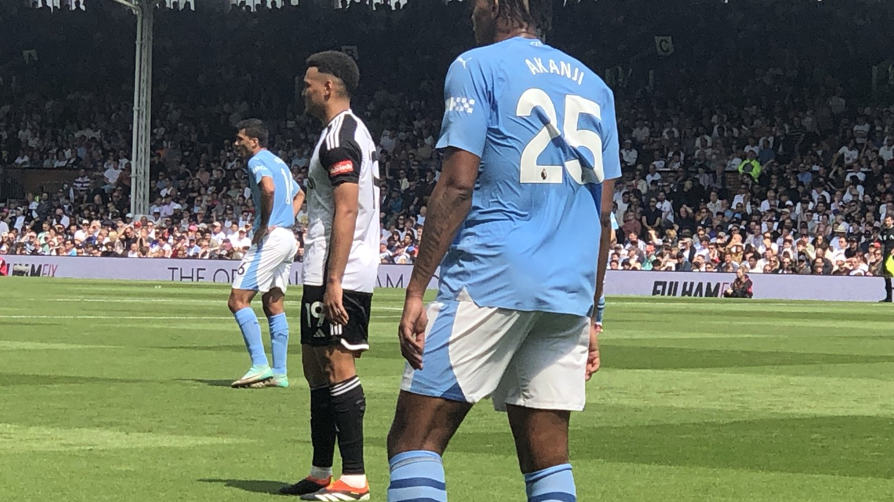

# Топ-7 индивидуальных наград ЧМ-2026: Испания забрала почти всё

_Родри – «Золотой мяч», Мбаппе – «Золотая бутса», а сборная Испания собрала большинство личных призов чемпионата мира 2026 года. Разбираем семь главных индивидуальных наград турнира._

**Категория:** ЧМ-2026 · **Тип:** ranking

Чемпионат мира 2026 года завершился триумфом сборной Испании, и распределение личных наград это лишь подтвердило: «Фурия Роха» забрала большинство ключевых призов турнира. Победа в финале над Аргентиной со счётом 1:0 стала логичным итогом доминирования, которое подтвердили и индивидуальные номинации.

Мы отобрали семь главных индивидуальных отличий мирового первенства – критерием стали значимость награды и вклад игрока в итоговый результат. Данные приводятся по материалам Olympics.com, ESPN и Yahoo Sports.

## 1. Родри – «Золотой мяч»

Капитан и опорник сборной Испании Родри получил «Золотой мяч» как лучший игрок чемпионата мира. Именно он дирижировал игрой команды, которая пропустила за весь турнир лишь один мяч и дошла до титула. Награда стала логичным признанием его роли стержня чемпионской сборной.

## 2. Килиан Мбаппе – «Золотая бутса»

Француз Килиан Мбаппе стал лучшим бомбардиром турнира с 10 забитыми мячами и завоевал «Золотую бутсу». Примечательно, что его сборная не добралась до финала – Францию в полуфинале остановила Испания, – однако по личной результативности форвард не знал равных.

## 3. Лионель Месси – «Серебряный мяч» и «Серебряная бутса»

Аргентинец Лионель Месси стал вторым в голосовании за звание лучшего игрока турнира («Серебряный мяч») и вторым бомбардиром с 8 голами («Серебряная бутса»). Для 39-летнего капитана «альбиселесте» это очередное подтверждение уровня: он снова довёл команду до финала мирового первенства.

## 4. Килиан Мбаппе и «Бронзовый мяч»

По итогам голосования «Бронзовый мяч» как третьему по силе игроку турнира также достался Килиану Мбаппе, что подчёркивает его статус одной из главных звёзд первенства наравне с Родри и Месси.

## 5. Унаи Симон – «Золотая перчатка»

Голкипер испанцев Унаи Симон признан лучшим вратарём чемпионата. Его надёжность стала фундаментом рекордной обороны, пропустившей всего один гол за весь турнир. В решающих матчах плей-офф именно уверенная игра Симона не раз выручала команду.

## 6. Пау Кубарси – лучший молодой игрок

Молодой центральный защитник Испании Пау Кубарси получил приз лучшему молодому футболисту первенства. Он сыграл ключевую роль в самой скупой обороне ЧМ-2026 и стал одним из открытий турнира, несмотря на юный возраст.

## 7. Ферран Торрес – герой финала

Форвард Ферран Торрес забил единственный и золотой гол финала против Аргентины и был признан игроком решающего матча. Вышедший на замену нападающий на 106-й минуте замкнул скидку Нико Уильямса – один точный удар в дополнительное время принёс Испании чемпионство и вписал имя Торреса в историю мировых первенств.

## Испания – новый эталон

Отдельно стоит отметить, что победа сделала Испанию обладателем сразу двух титулов чемпионов мира – мужского и женского (после успеха женской сборной в 2023 году). Доминирование испанцев в личных номинациях – от Родри и Унаи Симона до Пау Кубарси – закрепило за этим поколением статус эталона мирового футбола.

> Испания собрала личные награды ЧМ-2026 – от Родри и Унаи Симона до Пау Кубарси, – отмечает Yahoo Sports.

Источники: Olympics.com, ESPN, Yahoo Sports.
